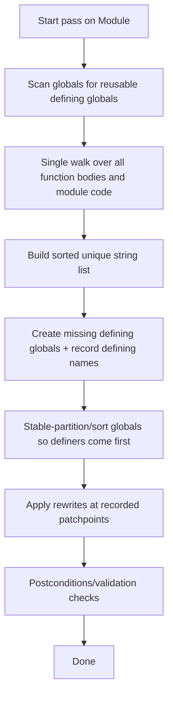

# Binaryen StringGathering Pass Deep Research and Single-Pass Reimplementation Blueprint

## Executive summary

The **StringGathering** pass in entity["organization","Binaryen","wasm optimizer project"] is a **module-level canonicalization** pass whose sole job is to **lift every `string.const` expression out of executable code and into immutable globals**, then **replace each `string.const` use with a `global.get`** of the corresponding global. This is described in the implementation as avoiding repeated appearances of `string.const` “in code that can run more than once,” reducing VM overhead by ensuring string constants are created once at instantiation rather than repeatedly at runtime. fileciteturn21file0L1-L1

Binaryen implements StringGathering as a single logical pass with three internal stages: **(a) scan the module**, collecting pointers to all `StringConst` nodes and the deduplicated set of strings; **(b) add/reuse string globals**, generating deterministic global names and hoisting them early enough to satisfy Wasm global-init dependency rules; **(c) rewrite** the collected `StringConst` nodes into `global.get` nodes. fileciteturn21file0L1-L1

A key correctness detail is **idempotence-safe global reuse**: If an existing immutable, non-imported global of type `(ref string)` is initialized directly with a `string.const`, Binaryen reuses it as the defining global for that string and records the initializer pointer so it is **not rewritten**, avoiding turning the initializer into a self-referential `global.get`. fileciteturn21file0L1-L1 This behavior is explicitly tested (e.g., `$global` reused for `"foo"`, while a same-string global with the wrong type is not reused). fileciteturn23file0L1-L1

In Binaryen’s default optimization pipeline, StringGathering runs in the **global post** phase when `optimizeLevel >= 2` and the module has the **Strings** feature enabled, positioned **immediately before `reorder-globals`** (which will subsequently perform more refined ordering). fileciteturn22file0L1-L1

In the provided entity["organization","jtenner/starshine-mb","MoonBit wasm optimizer repo"] repo, mirroring Binaryen’s pipeline is an explicit goal, and `StringGathering` is documented as currently missing from the global post pipeline and tracked as a publishing blocker, making a faithful implementation directly actionable. fileciteturn16file0L1-L1 fileciteturn17file0L1-L1

## Source baseline and integration constraints

Binaryen’s StringGathering implementation lives alongside string-lowering utilities (the file is named `StringLowering.cpp` but contains a dedicated `struct StringGathering : public Pass`). fileciteturn21file0L1-L1 The pass is registered under the CLI name **`string-gathering`** with description “gathers wasm strings to globals.” fileciteturn22file0L1-L1

Binaryen’s default pipeline explicitly guards StringGathering behind both (a) optimization level and (b) feature availability:

- Condition: `options.optimizeLevel >= 2 && wasm->features.hasStrings()`  
- Placement: “right before reorder-globals, which will then sort them properly.” fileciteturn22file0L1-L1

The Starshine repository describes itself as Binaryen-inspired in pass order but not strictly identical, and specifically calls out the absence of Binaryen’s `string-gathering` in the global post pipeline as a known parity gap. fileciteturn16file0L1-L1 The same repo’s task tracker lists “Implement `StringGathering` in the global post pipeline under the appropriate feature/optimization gates” as a near-term delivery blocker, strongly implying the desired target is a faithful port rather than a novel redesign. fileciteturn17file0L1-L1

Assumptions for this report (explicit where Binaryen and Starshine differ or where Starshine IR specifics are not provided in the prompt):

- **Binaryen baseline:** Read from the Binaryen `main` branch content retrieved here (commit hash visible in tool URLs as `66c7166f…`). fileciteturn22file0L1-L1  
- **Target for reimplementation:** Starshine pass infrastructure (MoonBit), module-level pass, intended to run at **`-O2`+** when the module enables the **Strings** feature (or the analogous Starshine feature flag). fileciteturn22file0L1-L1 fileciteturn16file0L1-L1  
- **IR naming model:** If Starshine references globals by **name** (Binaryen-style), the reordering step can be structural only; if Starshine references globals by **index**, the implementation must include an index remap/update step when creating “defining globals first”.

## Detailed feature list of Binaryen’s StringGathering pass

### What it detects

StringGathering detects **all `StringConst` nodes** (`string.const` in text form) in two places:

- **All defined (non-imported) functions**: It walks each non-imported function body. fileciteturn21file0L1-L1  
- **“Global module code”**: It also scans module-level code paths via `walkModuleCode(module)`, which is how Binaryen catches `string.const` occurrences in **global initializers** (including nested positions, e.g. inside `struct.new`). fileciteturn21file0L1-L1 fileciteturn23file0L1-L1

The scanning is implemented through a `PostWalker` visitor that records **mutable pointers to expression slots** (`Expression**`), not just the expressions themselves, so replacement can be done without a second AST walk. fileciteturn21file0L1-L1

### What it transforms

For each detected `string.const "S"` occurrence that is not a preserved reusable-global initializer:

- Creates or reuses an immutable global `G_S : (ref string)` initialized to `string.const "S"`.
- Replaces the original `string.const "S"` expression with `(global.get $G_S)` typed as **non-nullable stringref** (`(ref string)` in text). fileciteturn21file0L1-L1

The pass does **not** attempt to rewrite existing `global.get` uses into other forms; it strictly replaces `string.const` occurrences. This is explicitly noted in tests (“Existing global.gets are not modified … SimplifyGlobals could help”). fileciteturn23file0L1-L1

### Heuristics and constraints

Binaryen’s StringGathering includes several non-trivial policies that matter for correctness, determinism, and idempotence:

| Category | Binaryen behavior | Why it matters |
|---|---|---|
| Deterministic ordering | Collects unique strings into a set, then sorts them “alphabetically” (lexicographic order on the stored string representation) before generating globals. fileciteturn21file0L1-L1 | Ensures stable output across runs/toolchains, important for build reproducibility and for tests. |
| Reuse existing globals | Reuses a global **only if** it is: type `(ref string)` **non-nullable**, **defined** (not imported), **immutable**, and init is a direct `string.const`. fileciteturn21file0L1-L1 | Enables idempotence (re-running pass doesn’t keep adding globals) and avoids rewriting an initializer into a self reference. |
| Reuse only first match | If multiple globals define the same string, the first eligible one encountered becomes the canonical defining global; other defining globals get rewritten to `global.get` of the chosen one. fileciteturn21file0L1-L1 fileciteturn23file0L1-L1 | Prevents ambiguity and ensures a single canonical global per string. |
| Do not reuse imports | Imported globals are ignored for reuse. fileciteturn21file0L1-L1 fileciteturn23file0L1-L1 | Imports could have runtime semantics or ordering constraints; reuse would also complicate idempotence. |
| Do not reuse mutable globals | Mutable globals cannot be reused; instead, a fresh immutable defining global is created and the mutable one is rewritten to reference it. fileciteturn23file0L1-L1 | Avoids treating a mutable location as a canonical constant definition. |
| Name generation uses WTF-16 → WTF-8 | For newly created globals, Binaryen converts the internal string from WTF-16 to WTF-8, escapes it, and prefixes `string.const_…`, then runs a “valid name” helper to avoid collisions. fileciteturn21file0L1-L1 | Produces readable, deterministic, and valid identifiers even for unusual strings. |
| Global ordering safety | After adding/reusing defining globals, Binaryen stable-sorts globals so **defining globals appear first**, because other global initializers may reference them after rewriting. fileciteturn21file0L1-L1 | Required for Wasm validation: a global initializer may only reference earlier globals (unless imported). |

### Data structures used

Binaryen’s implementation uses the following core data structures:

| Purpose | Structure | Notes |
|---|---|---|
| Record all string uses | `std::vector<Expression**> stringPtrs` | Points directly to replaceable expression slots. fileciteturn21file0L1-L1 |
| Deduplicate strings | `std::unordered_set<Name> stringSet` then `std::vector<Name> strings` | Produces a unique set then a sorted vector for determinism. fileciteturn21file0L1-L1 |
| Map string → defining global name | `std::unordered_map<Name, Name> stringToGlobalName` | Filled by reuse scan and by new-global creation. fileciteturn21file0L1-L1 |
| Preserve reused global initializers | `std::unordered_set<Expression**> stringPtrsToPreserve` | Critical idempotence/cycle avoidance mechanism. fileciteturn21file0L1-L1 |
| Ensure defining globals occur early | `std::unordered_set<Name> definingNames` and stable-sort predicate | Imposes ordering constraints cheaply, leaving full optimization to later passes. fileciteturn21file0L1-L1 |

### Interactions with other passes and ordering requirements

Binaryen’s default global post pipeline runs StringGathering after global simplification and dead-module-element cleanup, and before reorder-globals. fileciteturn22file0L1-L1 The ordering is meaningful:

- Running after `simplify-globals` / `remove-unused-module-elements` reduces work (fewer strings in dead code). fileciteturn22file0L1-L1  
- Running before `reorder-globals` allows the subsequent pass to compute a better ordering and finalize layout after string globals have been introduced; Binaryen comments that the local stable-sort is “simple” and “may be unoptimal” but is adequate for validation until `reorder-globals` runs. fileciteturn21file0L1-L1

StringLowering is implemented as a subclass of StringGathering: it explicitly invokes StringGathering first “so all string.consts are in one place,” then proceeds to lower types and operations. fileciteturn21file0L1-L1 This is a strong confirmation that StringGathering is the shared canonicalization step for *all* further string lowering in Binaryen.

### Edge cases covered by Binaryen tests

Binaryen’s `string-gathering.wast` includes explicit regression coverage for:

- Reusing an existing eligible global defining `"foo"` and not adding another. fileciteturn23file0L1-L1  
- Rejecting reuse when the type is wrong (`(ref null string)` is not the exact `(ref string)` required). fileciteturn23file0L1-L1  
- Ignoring imported globals as candidates for reuse. fileciteturn23file0L1-L1  
- Ensuring mutable globals are not reused, creating a new immutable defining global and rewriting users accordingly. fileciteturn23file0L1-L1  
- Ensuring global ordering is repaired when a string occurrence appears in a global initializer that precedes the canonical defining global in the input ordering (the pass must reorder globals so the defining global becomes earlier). fileciteturn23file0L1-L1  

## Single-pass implementation plan with dataflow and pseudocode

This section provides an implementable plan that reproduces Binaryen’s semantics while keeping the pass to **one IR walk** (plus O(k) patch application), suitable for Starshine or another IR with similar constructs.

### High-level dataflow



Binaryen’s core insight is to store **patchpoints** (mutable expression references) during the single walk, so rewriting does not require a second traversal. fileciteturn21file0L1-L1

### Required analyses and invariants

The pass needs only lightweight analyses:

- **Global eligibility analysis**: classify each global as reusable defining global if it matches the strict type/immutability/import/init shape. fileciteturn21file0L1-L1  
- **Occurrence collection**: collect a list of patchpoints for `string.const` occurrences in:
  - defined functions only, and
  - all module code (global initializers and other module-level expressions). fileciteturn21file0L1-L1  
- **Deterministic string ordering**: sort the unique set of strings. fileciteturn21file0L1-L1  

Key invariants to preserve:

1. Each distinct string literal `S` corresponds to exactly one canonical defining global `G_S` after the pass. fileciteturn21file0L1-L1  
2. No reused global initializer is rewritten (prevents cycles). fileciteturn21file0L1-L1  
3. Any global initializer that now references `G_S` must appear **after** `G_S` in definition order (or `G_S` must be imported), which is enforced by the “definers first” reorder step. fileciteturn21file0L1-L1  

### Precise IR patterns to match and rewrite

The core transformation rules can be summarized as:

| Input pattern | Condition | Output pattern |
|---|---|---|
| `string.const "S"` anywhere in code or module init | Patchpoint not preserved | `global.get $G_S` |
| `(global $g (ref string) (string.const "S"))` | `$g` is defined, immutable, correct non-nullable type | Reuse `$g` as `G_S` and preserve its init |
| Any additional `string.const "S"` global initializer | Not preserved | Rewrite initializer to `(global.get $G_S)` |
| `string.const` inside nested global initializer (e.g. `struct.new` child) | Always rewritten | Replace leaf with `(global.get $G_S)`; ensure `$G_S` ordered before this global |

These behaviors are asserted by Binaryen’s pass code and tests. fileciteturn21file0L1-L1 fileciteturn23file0L1-L1

### Single-pass pseudocode blueprint

Below is a direct pseudocode translation of Binaryen’s design, expressed in a language-neutral style suitable for Starshine/MoonBit or a C++ reimplementation.

```text
PASS StringGathering(Module M):

  TYPE NNStringRef = (ref nonnull string)

  # State
  map<String, GlobalName> string_to_global = {}
  set<Patchpoint> preserve_patchpoints = {}
  list<Patchpoint> string_const_patchpoints = []
  set<String> unique_strings = {}
  set<GlobalName> defining_names = {}

  # Step 1: detect reusable defining globals (idempotence + cycle avoidance)
  for each global G in M.globals:
    if G.is_import: continue
    if G.is_mutable: continue
    if G.type != NNStringRef: continue
    if G.init is StringConst(S):
        if string_to_global[S] is unset:
            string_to_global[S] = G.name
            preserve_patchpoints.add(address_of(G.init))

  # Step 2: single walk to collect string.const patchpoints + strings
  # Must walk:
  #  - all defined functions (skip imported)
  #  - module-level code (global initializers, etc.)
  for each defined function F in M.functions:
    walk_expression_tree_with_mutable_pointers(F.body):
      if current_node is StringConst(S):
        string_const_patchpoints.push(current_patchpoint)
        unique_strings.add(S)

  walk_module_code_with_mutable_pointers(M):
    if current_node is StringConst(S):
      string_const_patchpoints.push(current_patchpoint)
      unique_strings.add(S)

  # Step 3: deterministic ordering of strings
  strings_sorted = sort_lexicographically(list(unique_strings))

  # Step 4: ensure defining global exists for every string
  for each S in strings_sorted:
    if string_to_global[S] exists:
        defining_names.add(string_to_global[S])
        continue

    # Name generation: string.const_<escaped(wtf8(S))> with uniqueness
    candidate = "string.const_" + escape_for_identifier(convert_wtf16_to_wtf8(S))
    name = make_unique_global_name(M, candidate)

    string_to_global[S] = name
    defining_names.add(name)

    # Create new immutable defining global: (global $name (ref string) (string.const S))
    newG = Global(
      name = name,
      type = NNStringRef,
      mutable = false,
      init = StringConst(S),
      imported = false
    )
    M.add_global(newG)

  # Step 5: global ordering safety
  # stable-partition such that defining globals appear first
  M.globals = stable_partition(M.globals,
                              predicate = (G -> G.name in defining_names))

  # Step 6: apply rewrites at patchpoints (no second AST traversal)
  for each patchpoint P in string_const_patchpoints:
    if P in preserve_patchpoints: continue
    assert *P is StringConst(S)
    Gname = string_to_global[S]
    *P = GlobalGet(Gname, NNStringRef)

  # Step 7: optional safety checks (recommended in Starshine)
  assert no non-preserved StringConst remain
  assert all referenced globals exist
  assert global initializers only refer to earlier defined or imported globals
```

Each numbered step corresponds directly to methods in Binaryen’s `StringGathering::run` (`processModule`, `addGlobals`, `replaceStrings`). fileciteturn21file0L1-L1

### Memory/layout decisions and symbol/table updates

Binaryen’s implementation is name-based; it inserts globals and then stable-sorts the global vector without needing to rewrite “indices” inside `global.get`. fileciteturn21file0L1-L1 If Starshine uses **index-based global references**, you need an explicit index remap step:

- After stable-partitioning globals, compute `old_index -> new_index` permutation.
- Rewrite every `global.get` / `global.set` immediate and any other global references across the module to use the new indices.
- Ensure imports remain in a valid prefix region if your validator enforces import-before-define ordering (Binaryen’s code sorts within `module->globals` but does not explicitly separate imports; you may need to preserve the import prefix region in Starshine).

A robust approach for index-based IR is:

1. Stable-partition globals into `(imports, defining_defs, other_defs)` while preserving order within each group.
2. Build permutation and rewrite global indices.
3. Only then apply patchpoint rewrites (or apply rewrites but treat global references as symbolic until emit-time).

### Safety checks and failure modes

Binaryen relies on its validator and later passes; Starshine should add explicit checks to catch common implementation errors early.

Recommended checks:

- **Cycle prevention:** If you reuse an existing defining global, you must preserve its initializer from rewriting, or you will create an invalid self-referential initializer. fileciteturn21file0L1-L1  
- **Type check:** Only reuse globals with exact non-nullable stringref type (Binaryen uses `Type(HeapType::string, NonNullable)`). fileciteturn21file0L1-L1  
- **Ordering validity:** After rewriting global initializers, all `global.get` in initializers must point to earlier globals (or imports). The “definers first” stable sort is Binaryen’s correctness mechanism here. fileciteturn21file0L1-L1 fileciteturn23file0L1-L1  
- **Determinism check:** Ensure string sorting and name generation are deterministic; tests should lock the ordering (`"bar"` before `"foo"` etc.). fileciteturn23file0L1-L1  

Failure modes to report clearly (especially in an automated agent context):

- “Encountered `string.const` but Strings feature disabled” (policy decision: no-op vs error; Binaryen’s default pipeline only runs when feature is enabled). fileciteturn22file0L1-L1  
- “Cannot allocate unique global name” (should be impossible if you include a uniquifier). fileciteturn21file0L1-L1  
- “Index-based global ordering rewrite not implemented” (if Starshine IR is index-based and you skip the remap, the module will likely fail validation).

## Complexity and correctness considerations

### Time and space complexity

Let:

- `N` = total number of expression nodes in all defined function bodies + module code walked
- `K` = number of `string.const` occurrences
- `U` = number of unique string literals

Binaryen’s structure implies:

- One AST walk: **O(N)**  
- Dedup set insertion: **O(K)** expected  
- Sorting unique strings: **O(U log U)**  
- Patchpoint rewrite: **O(K)**  
- Global stable partition/sort: **O(G log G)** in Binaryen (it uses `stable_sort`) where `G` is number of globals; a stable partition can make this **O(G)** if desired. fileciteturn21file0L1-L1  

Space:

- Patchpoint storage: O(K)
- Unique string set + mapping: O(U)

### Correctness argument sketch

The pass is correct relative to Binaryen’s stated goal (“avoid appearing in code that can run more than once”) because:

1. Every runtime-evaluated `string.const` in a function body becomes a `global.get`. The value is then created during module instantiation (global initializer evaluation), not repeatedly during function execution. fileciteturn21file0L1-L1  
2. For string constants appearing in global initializers, rewriting preserves semantics provided the defining global remains immutable and produces the same string value; ordering is repaired so the initializer remains valid. fileciteturn21file0L1-L1  
3. Reuse/preserve logic prevents introduction of cyclic initializers, maintaining validity and ensuring idempotence on repeated application. fileciteturn21file0L1-L1  

One subtle semantic point worth calling out for reimplementations: stable-reordering globals changes **initialization order** of independent globals. Binaryen treats this as safe because the globals it moves are immutable defining globals initialized with `string.const`, a constant-like operation in its worldview. fileciteturn21file0L1-L1 Your IR/validator must share the same assumption (or you must ensure the reorder does not move trapping/side-effecting initializers earlier).

## Tests and validation plan

A strong validation plan should combine:

- **Golden output tests** (text format / S-expr snapshots, as Binaryen does with lit+FileCheck), and
- **Structural invariants** asserted via the validator (no invalid global-init references; no remaining string.const except preserved defining initializers).

### Representative test cases

The following test suite is directly aligned to Binaryen’s own coverage and should be ported nearly verbatim to Starshine’s test harness.

#### Reuse defining global and deterministic ordering

Input shape (conceptual):

- Existing immutable global `$global : (ref string) = string.const "foo"`
- Several `string.const` uses in functions: `"bar"`, `"foo"`, `"other"`

Expected:

- No new defining global created for `"foo"` (reuse `$global`).
- New globals created for `"bar"` and `"other"` with deterministic ordering (`bar`, `foo`, `other`).
- All `string.const` in function bodies replaced with `global.get` of those defining globals. fileciteturn23file0L1-L1

Binaryen’s test asserts exactly these properties, including the ordering and the reusing behavior. fileciteturn23file0L1-L1

#### Ignore near-miss reuse due to wrong type

Input:

- A global initialized with `string.const "bar"` but typed `(ref null string)`.

Expected:

- It is **not** reused as the defining global for `"bar"`; a proper `(ref string)` defining global is created and the near-miss global is rewritten to reference it (or remains separate depending on your implementation, but Binaryen’s test shows the wrong-typed global is not reused). fileciteturn23file0L1-L1

#### Ignore imported globals as reuse candidates

Input:

- Imported global `$import : (ref string)`.

Expected:

- Ignore `$import` for reuse; do not treat it as a defining global. fileciteturn23file0L1-L1

#### Multiple possible reusable globals, pick first, rewrite others

Input:

- Several globals each initialized with `string.const "foo"`.

Expected:

- Exactly one canonical defining global remains (the first eligible one), and the others become `global.get` of that canonical one. fileciteturn23file0L1-L1

#### Mutable global cannot be reused

Input:

- `(global $g (mut (ref string)) (string.const "foo"))`

Expected:

- Create a fresh immutable defining global for `"foo"`, and rewrite `$g`’s initializer to `global.get` of the new immutable defining global. fileciteturn23file0L1-L1

#### Global ordering repair for nested initializer case

Input:

- A global `$struct` initialized with `struct.new (string.const "")` **before** a later global `$string` initialized with `string.const ""`.

Expected:

- After the pass, both occurrences share a single defining global (reusing `$string`), and globals are reordered so `$string` appears before `$struct`, making `$struct` initializer valid after rewrite. fileciteturn23file0L1-L1

#### Idempotence test

Procedure:

- Run StringGathering twice.

Expected:

- Second run makes **zero changes** (no additional globals created, no rewrites), due to reuse and preserve logic. fileciteturn21file0L1-L1

### Validation checks to assert in the test harness

For each fixture (after pass):

- Module validates (especially global initializer constraints).
- For every `string.const` occurrence:
  - It is either inside a preserved defining global initializer, or the test fails.
- For each unique string `S`, there exists exactly one defining global whose initializer is `string.const S`.

## Agent prompt for one-shot implementation

### Prompt

You are an automated compiler engineer implementing a Binaryen-parity pass in the Starshine (MoonBit) optimizer. Implement a new **module-level pass** named `StringGathering` that matches Binaryen’s `string-gathering` semantics.

**Primary reference behavior (must match):**
- Binaryen’s `StringGathering` in `src/passes/StringLowering.cpp` and its regression tests in `test/lit/passes/string-gathering.wast`. fileciteturn21file0L1-L1 fileciteturn23file0L1-L1  
- Default pipeline gate: run in global post passes when optimize level ≥ 2 and the module has the Strings feature; place immediately before `ReorderGlobals` (or Starshine equivalent). fileciteturn22file0L1-L1  
- Starshine parity context: this pass is currently missing and should be added to close the documented gap. fileciteturn16file0L1-L1

**What to implement:**
1. Add a new pass implementation file (e.g., `src/passes/string_gathering.mbt`) implementing:
   - A single IR walk over all defined functions and module code collecting mutable patchpoints to `string.const`.
   - A pre-scan over globals to identify reusable defining globals:
     - Defined (not imported), immutable, exact non-nullable stringref type, initializer is a direct `string.const`.
     - Reuse only the first such global per string.
     - Record its initializer patchpoint in a `preserve` set so it is not rewritten.
   - Deterministic sorted list of unique strings.
   - For each unique string, create a new immutable defining global if not already mapped:
     - Generate a readable deterministic name with prefix `string.const_...` derived from escaped UTF-8/WTF-8 form and uniquified against collisions.
   - Reorder globals so defining globals appear before any globals that may reference them after rewriting (stable partition preferred).
   - Rewrite all collected `string.const` patchpoints (except preserved) into `global.get` of the defining global.

2. Wire it into the pass registry / scheduler:
   - Expose pass name `StringGathering` and CLI/scheduler name `string-gathering` (or Starshine naming convention), and ensure it is invoked in the optimized global post pipeline at `-O2`+ under Strings feature gating.

3. Add tests mirroring Binaryen fixtures:
   - Reuse eligible global; ignore wrong-type/mutable/imported; multiple duplicate defining globals; nested global initializer ordering repair; idempotence (run twice).
   - Tests must assert both structural validity and expected transformed shapes (global definitions inserted, `string.const` replaced with `global.get`, global ordering constraints satisfied).

**Required inputs:**
- A Starshine `Module` containing:
  - functions (some imported, some defined),
  - globals with initializers (some string.const, some nested string.const),
  - a feature flag indicating whether Strings are enabled.

**Required outputs:**
- Mutated module satisfying:
  - No runtime `string.const` occurrences remain outside preserved defining-global initializers.
  - Exactly one defining immutable global per unique string literal.
  - Global initializer ordering remains valid (no initializer references a later-defined global).

**Failure modes (must be explicit, with clear error text):**
- If the IR uses index-based global references and you reorder globals, you must also update all global indices. If you cannot implement index remapping, fail fast with a descriptive message rather than silently producing invalid modules.
- If name generation collides and uniquification fails, error with details.
- If Strings feature is disabled, the pass should either:
  - no-op (preferred for pipeline safety, matching Binaryen’s pipeline gating), or
  - error only when `string.const` is present (choose one policy and document it).

**Done criteria:**
- All tests pass.
- The pass is deterministic across runs.
- Running the pass twice is a no-op on the second run.
- The pass is scheduled by default under the correct gates and closes the documented parity gap.

### Notes for the agent

- Do not implement StringLowering; implement **only** StringGathering as described.
- Prefer an O(N) single-walk design with patchpoints rather than re-walking the same IR multiple times.
- Keep behavior aligned to Binaryen, even if Starshine could do more aggressive folding: avoid extra transforms beyond string.const → global.get and defining-global insertion.